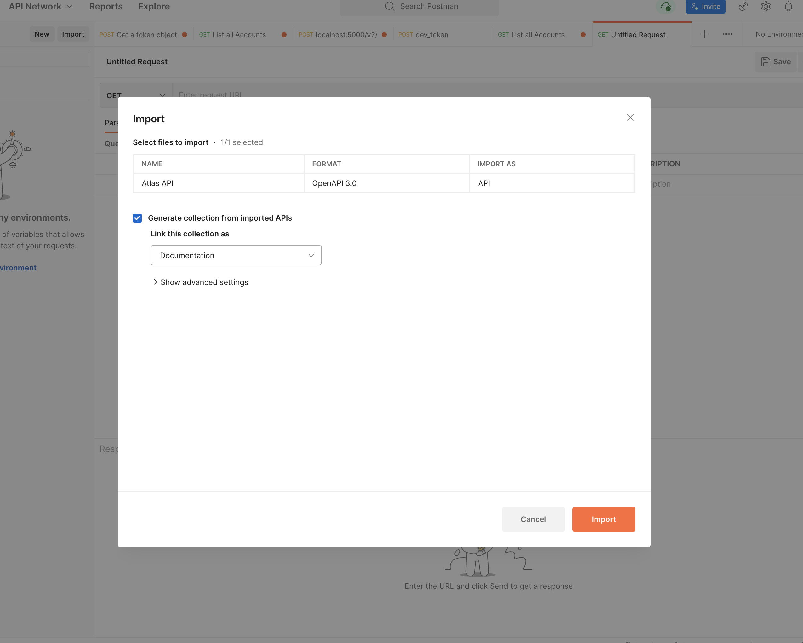
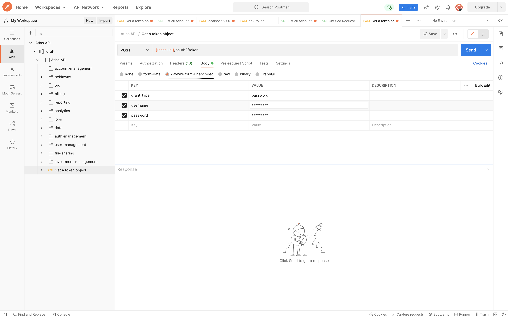

## Generating postman collections from swagger docs

URL to swagger docs: https://docs.bridgeft.com/openapi/623a0b06cc9604045f56053a

Steps:

1. Open Postman (picture below) and click `import` located on the top left section.

2. On the import section, select the `link` option from the tap options and enter the above url on the url form.

3. Once the url is entered, click `continue` and click `import` in the next page to keep the default settings. 

4. The postman collections are listed on the `APIs` and `Collections` section on the left menu. 

5. To generate token, go to the `Get a token object` endpoint and enter the credentials (username and password) on the `x-www-form-urlencoded` option for `Body` of the request. Click `Send` to generate token. 

